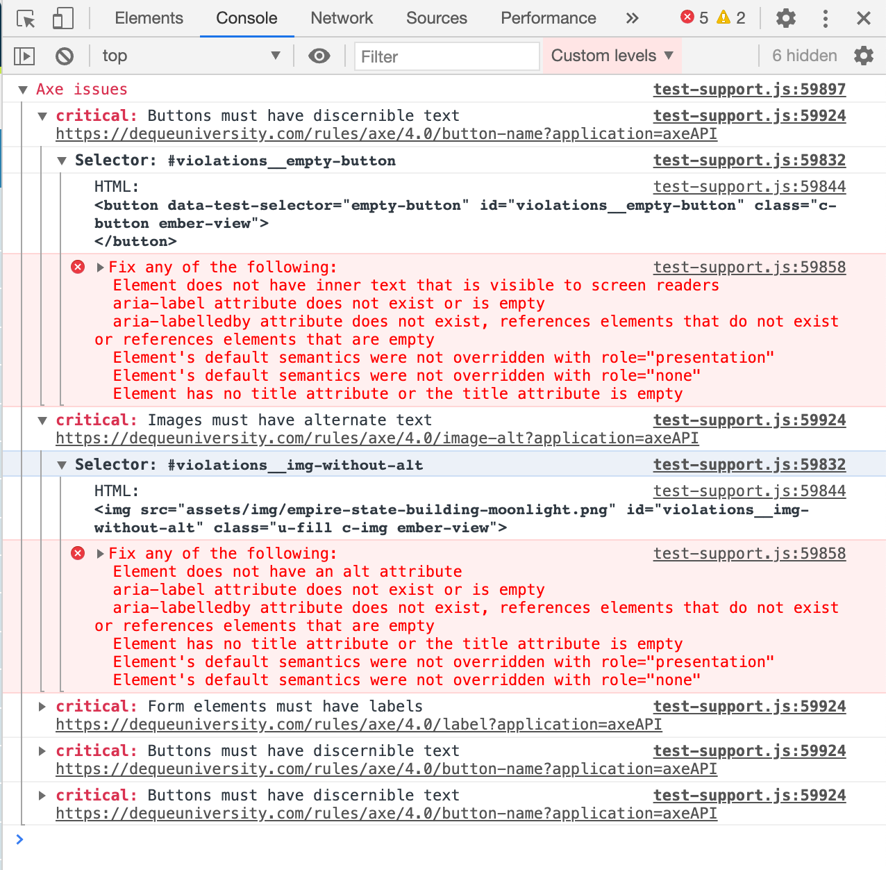

# ember-a11y-testing

[](https://github.com/ember-a11y/ember-a11y-testing/actions/workflows/ci.yml?query=workflow%3ACI)
[](http://badge.fury.io/js/ember-a11y-testing)
[](https://emberobserver.com/addons/ember-a11y-testing)

`ember-a11y-testing` is a wrapper around [Deque Labs'](https://github.com/dequelabs)
[axe-core](https://github.com/dequelabs/axe-core) accessibility testing engine.
It integrates into your testing environment using either a one-time setup, or in
individual tests using an `a11yAudit()` test helper.

## Compatibility

* Ember.js v3.8.0 or above
* Ember CLI v3.8 or above
* Node.js v12 or above
* `@ember/test-helpers` v2.0.0 or above

Note: we enforce a peerDependency of `@ember/test-helpers`. If you encounter the following message:

```shell
ember-a11y-testing has the following unmet peerDependencies:
  * @ember/test-helpers: `^2.0.0`; it was resolved to `x.x.x`
```

please update your version of `@ember/test-helpers` in your package.json accordingly.

## Installation

```bash
ember install ember-a11y-testing
```

## Usage

Usage of `ember-a11y-testing` in your tests can be done in one of two ways:

1. A one-time setup in your tests/test-helper.js file using `setupGlobalA11yHooks`
1. In individual tests using the `a11yAudit` test helper.

### axe Options

When using the `a11yAudit` helper, you can pass in `axe-core` options that are passed to `axe.run`.
These options are documented in the [axe-core API docs](https://www.deque.com/axe/core-documentation/api-documentation/#user-content-options-parameter).
The rule definitions are documented on [dequeuniversity.com/rules](https://dequeuniversity.com/rules/axe/4.0).

Each of the following sections individually details how to set aXe options for your tests.

### `setupGlobalA11yHooks` Usage

The `setupGlobalA11yHooks` function is intended to be imported and invoked a single time in `tests/test-helper.js` for your entire test suite.

```ts
export interface InvocationStrategy {
  (helperName: string, label: string): boolean;
}

export interface GlobalA11yHookOptions {
  helpers: HelperName[];
}

type HelperName =
  | 'blur'
  | 'click'
  | 'doubleClick'
  | 'fillIn'
  | 'focus'
  | 'render'
  | 'scrollTo'
  | 'select'
  | 'tab'
  | 'tap'
  | 'triggerEvent'
  | 'triggerKeyEvent'
  | 'typeIn'
  | 'visit';

export const DEFAULT_A11Y_TEST_HELPER_NAMES = [
  'visit',
  'click',
  'doubleClick',
  'tap',
];

export function setupGlobalA11yHooks(
  shouldAudit: InvocationStrategy,
  audit: (...args: any[]) => PromiseLike<void> = a11yAudit,
  options: GlobalA11yHookOptions = { helpers: DEFAULT_A11Y_TEST_HELPER_NAMES }
);
```

The `setupGlobalA11yHooks` function takes three parameters:

- `shouldAudit`: An `InvocationStrategy` - a [predicate function](https://stackoverflow.com/a/1344021/769) that takes a `helperName` and a `label`, and returns a `boolean` indicating whether or not to perform the audit.
- `audit` (optional): The audit function, which performs the `axe-core` audit, defaulting to `a11yAudit`. This allows you to potentially wrap the `a11yAudit` test helper with custom logic.
- `options` (optional): Setup options, which allow you to specify after which test helpers to run the audit.

Using a custom `InvocationStrategy` implementation will allow you to maintain a high level of control over your test invocations. Examples of invocation strategies can be found in [this](https://github.com/ember-a11y/ember-a11y-testing/blob/50ef5f8fff4aa91d7a85b9feee5b1ce9bf380df9/tests/acceptance/setup-global-a11y-hooks-test.ts#L32) [repository's](https://github.com/ember-a11y/ember-a11y-testing/blob/50ef5f8fff4aa91d7a85b9feee5b1ce9bf380df9/tests/acceptance/setup-global-a11y-hooks-test.ts#L81) [tests](https://github.com/ember-a11y/ember-a11y-testing/blob/50ef5f8fff4aa91d7a85b9feee5b1ce9bf380df9/tests/acceptance/setup-global-a11y-hooks-test.ts#L135).

To use, import and invoke the global setup function, passing in your specific invocation strategy:

```js
// tests/test-helper.js
import Application from 'my-app/app';
import config from 'my-app/config/environment';
import { setApplication } from '@ember/test-helpers';
import { start } from 'ember-qunit';
import { setupGlobalA11yHooks } from 'ember-a11y-testing/test-support';
setApplication(Application.create(config.APP));

setupGlobalA11yHooks(() => true);

start();
```

:warning: It's important to note that you must also use the [`enableA11yAudit`](#force-running-audits) query parameter in order to force audits. This setting is required in addition to any invocation strategy you provide.

By default, audits will be run on `visit`, `click`, `doubleClick`, and `tap`. To add additional helpers to hook into, specify them by name in the `options.helpers` argument. Note that this option specifies the *complete* set of helpers to hook into; to include the defaults you must import them and splat them into the array as shown below.

```js
import {
  setupGlobalA11yHooks,
  DEFAULT_A11Y_TEST_HELPER_NAMES,
} from 'ember-a11y-testing/test-support';

setupGlobalA11yHooks(() => true, {
  helpers: [...DEFAULT_A11Y_TEST_HELPER_NAMES, 'render', 'tab'],
});
```

#### Setting Options using `setRunOptions`

You can provide options to axe-core for your tests using the `setRunOptions` API. This API is helpful if you don't have access to the `a11yAudit` calls directly, such as when using the `setupGlobalA11yHooks`, or if you want to set the same options for all tests in a module.

Options can be set a few ways:

Globally:

```javascript
// tests/test-helper.js
import { setRunOptions } from 'ember-a11y-testing/test-support';

setRunOptions({
  rules: {
    region: { enabled: true },
  },
});
```

Test module level:

```javascript
import { module, test } from 'qunit';
import { setRunOptions } from 'ember-a11y-testing/test-support';

module('some test module', function (hooks) {
  hooks.beforeEach(function () {
    setRunOptions({
      rules: {
        region: { enabled: true },
      },
    });
  });

  // ...
});
```

Individual test level:

```javascript
import { module, test } from 'qunit';
import { a11yAudit, setRunOptions } from 'ember-a11y-testing/test-support';

module('some test module', function (hooks) {
  test('some test', function (assert) {
    setRunOptions({
      rules: {
        region: { enabled: true },
      },
    });

    // ...
    a11yAudit();
    // ...
  });

  // ...
});
```

When using `setRunOptions` during a test, the options you set are automatically reset when the test completes.

### `a11yAudit` Usage

`ember-a11y-testing` provides a test helper to run accessibility audits on specific tests within your test suite. The `a11yAudit` helper is an async test helper which can be used in a similar fashion to other `@ember/test-helpers` helpers:

In Application tests:

```javascript
import { visit } from '@ember/test-helpers';
import { a11yAudit } from 'ember-a11y-testing/test-support';

module('Some module', function () {
  //...

  test('Some test case', async function (assert) {
    await visit('/');
    await a11yAudit();
    assert.ok(true, 'no a11y errors found!');
  });
});
```

The helper is also able to be used in Integration/Unit tests like so:

```javascript
import { render } from '@ember/test-helpers';
import { a11yAudit } from 'ember-a11y-testing/test-support';

// ...elided for brevity

test('Some test case', function (assert) {
  await render(hbs`{{some-component}}`);

  let axeOptions = {
    rules: {
      'button-name': {
        enabled: false,
      },
    },
  };

  await a11yAudit(this.element, axeOptions)

  assert.ok(true, 'no a11y errors found!');
});
```

#### Setting Options with `a11yAudit`

The helper can optionally accept a "context" on which to focus the audit as
either a selector string or an HTML element. You can also provide a secondary
parameter to specify axe-core options:

```js
test('Some test case', async function (assert) {
  let axeOptions = {
    rules: {
      'button-name': {
        enabled: false,
      },
    },
  };

  await visit('/');
  await a11yAudit(axeOptions);

  assert.ok(true, 'no a11y errors found!');
});
```

Or specify options as a single argument:

```js
test('Some test case', async function (assert) {
  let axeOptions = {
    rules: {
      'button-name': {
        enabled: false,
      },
    },
  };

  await visit('/');
  await a11yAudit('.modal', axeOptions);

  assert.ok(true, 'no a11y errors found!');
});
```

### Force Running audits

`ember-a11y-testing` allows you to force audits if `enableA11yAudit` is set as a query param
on the test page or the `ENABLE_A11Y_AUDIT` environment variable is provided. This is useful if you want to conditionally run accessibility audits, such
as during nightly build jobs.

To do so, import and use `shouldForceAudit` from `ember-a11y-testing`, as shown below.

```javascript
// `&enableA11yAudit` set in the URL
import { a11yAudit, shouldForceAudit } from 'ember-a11y-testing/test-support';

test('Some test case', await function(assert) {
  await visit('/');

  if (shouldForceAudit()) {
    await a11yAudit();
  }
  assert.ok(true, 'no a11y errors found!');
});
```

```javascript
// No `enableA11yAudit` set in the URL
import { a11yAudit, shouldForceAudit } from 'ember-a11y-testing/test-support';

test('Some test case', await function(assert) {
  await visit('/');

  if (shouldForceAudit()) {
    await a11yAudit();  // will not run
  }
  // ...
});
```

You can also create your own app-level helper, which will conditionally check whether to run the audits or not:

```javascript
export function a11yAuditIf(contextSelector, axeOptions) {
  if (shouldForceAudit()) {
    return a11yAudit(contextSelector, axeOptions);
  }

  return resolve(undefined, 'a11y audit not run');
}
```

#### QUnit and Testem integration

You can setup a new configuration checkbox in QUnit and Testem by using the `setupQUnitA11yAuditToggle`.
When the checkbox is checked, it will set `enableA11yAudit` as a query param.

To use, import and invoke the setup function, passing in your QUnit instance:

```js
// tests/test-helper.js
import Application from 'my-app/app';
import config from 'my-app/config/environment';
import * as QUnit from 'qunit';
import { setApplication } from '@ember/test-helpers';
import { start } from 'ember-qunit';
import { setupGlobalA11yHooks, setupQUnitA11yAuditToggle } from 'ember-a11y-testing/test-support';
setApplication(Application.create(config.APP));

setupGlobalA11yHooks(() => true);
setupQUnitA11yAuditToggle(QUnit);

start();
```

### Logging violations to the console

This addon provides the capability of summarizing all violations found during tests, and outputting those failures to the console once the test suite is completed. To enable this functionality, import `setupConsoleLogger` and invoke in your `tests/test-helper.js` file:

```js
import Application from 'my-app/app';
import config from 'my-app/config/environment';
import { setApplication } from '@ember/test-helpers';
import { start } from 'ember-qunit';
import { setupConsoleLogger } from 'ember-a11y-testing/test-support';

setApplication(Application.create(config.APP));

setupConsoleLogger();

start();
```

Example:



### Test Middleware

This addon provides middleware - code that allows the browser to talk to the node process running the tests via testem. This is useful in scenarios such as internal compliance monitoring used to track accessibility grades.

The middleware reporter writes the results containing all violations detected in all tests to a JSON file stored in a directory, `ember-a11y-report`, in your application or addon's root directory.

:warning: **Audit report files get generated in an additive manner, typically resulting in the `a11y-audit-report` directory growing in size as subsequent test suites are run. Environments with specific space size restrictions will require an explicit strategy to manage the deletion of older reports, as this addon no longer does so.**

To use the middleware reporter, import `setupMiddlewareReporter` and invoke in your `tests/test-helper.js` file:

```js
import Application from 'my-app/app';
import config from 'my-app/config/environment';
import { setApplication } from '@ember/test-helpers';
import { start } from 'ember-qunit';
import { setupMiddlewareReporter } from 'ember-a11y-testing/test-support';

setApplication(Application.create(config.APP));

setupMiddlewareReporter();

start();
```

A helper function is available to use the middleware reporter conditionally, allowing interoperability between the default reporter and the middleware reporter. Import `useMiddlewareReporter` and apply as a check around the `setupMiddlewareReporter` function in `tests/test-helper.js`. The middleware reporter will now only be invoked when `enableA11yMiddlewareReporter` is set as a query param on the test page or the `ENABLE_A11Y_MIDDLEWARE_REPORTER` environment variable is provided.

```js
import Application from 'my-app/app';
import config from 'my-app/config/environment';
import { setApplication } from '@ember/test-helpers';
import { start } from 'ember-qunit';
import { setupMiddlewareReporter, useMiddlewareReporter } from 'ember-a11y-testing/test-support';

setApplication(Application.create(config.APP));

if (useMiddlewareReporter()) {
  // Only runs if `enableA11yMiddlewareReporter` is set in URL
  setupMiddlewareReporter();
}

start();
```

Note, as a convenience, `useMiddlewareReporter` automatically forces audits, thus explicitly specifying
the `enableA11yAudit` query param or the `ENABLE_A11Y_AUDIT` environment variable is unnecessary.

### Development Usage

While this addon previously included a number of components that would aid in identifying axe violations during development, those have been deprecated in favor of other, industry standard tools such as:

- [**Accessibility Insights for Web**](https://accessibilityinsights.io/docs/en/web/overview) - Accessibility Insights for Web helps developers find and fix accessibility issues in web apps and sites. This browser extension for Chrome and the new Microsoft Edge runs on Windows, MacOS, and Linux computers.
- [**Lighthouse**](https://developers.google.com/web/tools/lighthouse) - an open-source, automated tool for improving the quality of web pages. You can run it against any web page, public or requiring authentication. It has audits for performance, accessibility, progressive web apps, SEO and more.
- [**Sa11y**](https://ryersondmp.github.io/sa11y/) - an accessibility quality assurance tool that visually highlights common accessibility and usability issues. Geared towards content authors, Sa11y indicates errors or warnings at the source with a simple tooltip on how to fix.
- [**axe Chrome extension**](https://www.deque.com/axe/browser-extensions/) - a free axe browser extension ideal for development teams to test web applications to help identify and resolve common accessibility issues.
