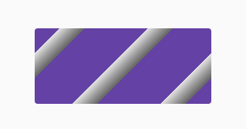
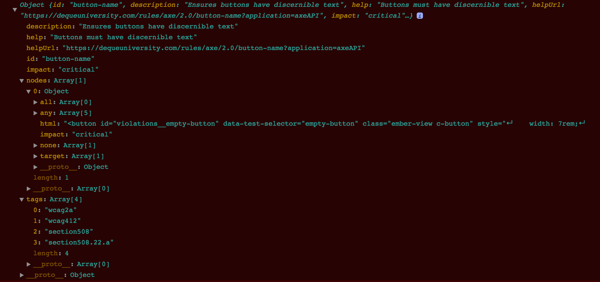
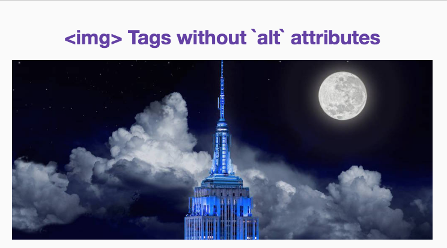

# ember-a11y-testing

[](https://travis-ci.org/ember-a11y/ember-a11y-testing)
[](http://badge.fury.io/js/ember-a11y-testing)
[](https://emberobserver.com/addons/ember-a11y-testing)

Ember A11y Testing is a wrapper around [Deque Labs'](https://github.com/dequelabs)
[axe-core](https://github.com/dequelabs/axe-core) accessibility testing engine.
It integrates into your testing environment with a simple `a11yAudit()` helper.

If you're using Ember 1.13.0 or above, it also integrates into your development
workflow by running during a component's `didRender` phase in non-production
environments. This gives you instant feedback on if your components are
accessible in any given state.

Installation
------------------------------------------------------------------------------

```bash
ember install ember-a11y-testing
```

## Usage

### aXe Options

When using the `a11yAudit` helper, you can pass in `axe-core` options.
These options are documents on [axe-core.org](https://axe-core.org/docs/#options-parameter).
The rule definitions are documented on [dequeuniversity.com/rules](https://dequeuniversity.com/rules/axe/3.0).

### Testing Usage

Ember A11y Testing also provides a simple helper to run accessibility audits
on-demand within your test suite.

_Note:_ any tests run with Ember A11y Testing will adjust the testing container
to occupy the entire screen. This is to simulate the actual application
environment, as browsers adjust styles at small sizes for accessibility reasons.
It will reset itself at the conclusion of testing though.

#### Acceptance Tests

For Acceptance tests, the helper is an async test helper so you can use it like
this:

```javascript
import a11yAudit from 'ember-a11y-testing/test-support/audit';

// ...elided for brevity

test('Some test case', function(assert) {
  visit('/');
  a11yAudit();
  andThen(() => assert.ok(true, 'no a11y errors found!'));
});
```

The helper can optionally accept a "context" on which to focus the audit as
either a selector string or an HTML element. You can also provide a secondary
parameter to specify axe-core options:

```js
test('Some test case', function(assert) {
  let axeOptions = {
    rules: {
      'button-name': {
        enabled: false
      }
    }
  };

  visit('/');
  a11yAudit(axeOptions);
  andThen(() => assert.ok(true, 'no a11y errors found!'));
});
```

Or specify options as a single argument:

```js
test('Some test case', function(assert) {
  let axeOptions = {
    rules: {
      'button-name': {
        enabled: false
      }
    }
  };

  visit('/');
  a11yAudit('.modal', axeOptions);
  andThen(() => assert.ok(true, 'no a11y errors found!'));
});
```

#### Integration and Unit Tests

The helper is also able to be used Integration/Unit tests like so:

```javascript
import a11yAudit from 'ember-a11y-testing/test-support/audit';

// ...elided for brevity

test('Some test case', function(assert) {
  this.render(hbs`{{some-component}}`);

  let axeOptions = {
    rules: {
      'button-name': {
        enabled: false
      }
    }
  };
  return a11yAudit(this.element, axeOptions).then(() => {
    assert.ok(true, 'no a11y errors found!');
  });
});
```

As you can see, the usage for all types of tests is pretty much the same. The
only real difference is Acceptance tests get automatic async handling.

#### Optionally Running a11yAudit

Ember A11y Testing also provides an `a11yAuditIf` helper which will only run
audits if `enableA11yAudit=true` is set as a query param on the test page. This
is useful if you want to conditionally run accessibility audits, such as during
nightly build jobs.

```javascript
import a11yAuditIf from 'ember-a11y-testing/test-support/audit-if';

test('Some test case', function(assert) {
  visit('/');
  a11yAuditIf(); // Only runs when enableA11yAudit=true is in the URL
  andThen(() => assert.ok(true, 'no a11y errors found!'));
});
```

### Development Usage

Usage in development is restricted to applications using Ember 1.13 and up, as it
relies on the `didRender` hook of a component's life-cycle (a feature only
available in versions of Ember with the Glimmer rendering engine).

That said, setup for development is as simple as it is for testing: simply
install the addon.

By default, Ember A11y Testing will audit a component for accessibility each
time it is rendered. This ensures that the component is still accessible even
after state changes, and since the checks are scoped to a component's element,
it means that any state change propagated downwards is also caught.

#### Inspecting Violations
When a violation is detected for a component's element, Ember A11y Testing will
attempt to visually indicate the violation by updating the component's
element `className`.

The class used is determined as follows:

1) If a component's `axeViolationClassNames` property is set, these names will always be used. This provides a way for you to customize the styling of a violation to your own needs.
  - `axeViolationClassNames` can be passed in your template, with each name as an element in a space-separated string:

  ```hbs
    {{x-button
      id="violations__empty-button"
      data-test-selector="empty-button"
      axeViolationClassNames="outline outline--red"
    }}
  ```

  - they can also be defined as an array of names within your component:

  ```javascript
    axeViolationClassNames: ['outline', 'outline--red']
  ```

2) By forgoing custom styling, you can rely on Ember A11y Testing's own set of
default styles. These are set according to a series of configurable
`visualNoiseLevel`s spanning from 1 to 3, and a special styling is applied to element's whose default appearance would require a different set of rules for visibility.

```hbs
  {{x-button
    id="violations__empty-button"
    data-test-selector="empty-button"
    visualNoiseLevel=2
  }}
```

The stylesheet that Ember A11y Testing gets these rules from can be found here[](),
but below are a few sample results for a [violation caused by a button without discernable text](https://github.com/dylanb/axe-core/blob/master/lib/rules/button-name.json).

"Noise" Level 1:



"Noise" Level 2:


"Noise" Level 3:


At the same time, a violation error message will be logged to the console with even more detailed information as to what went wrong. The following message corresponds to the same text input element above:




##### Special Styling for Background-replaced elements

As mentioned, some HTML elements are considered to be
["replaced" elements](https://developer.mozilla.org/en-US/docs/Web/CSS/Replaced_element), wherein their rendered appearance is -- to varying degrees --
determined by the browser and/or the content that the element
consists of.

An `img` is an example of a replaced element; it lacks the ability to be
styled through `background` definitions, as it's background is replaced with
its loaded source assets.

To get around this, Ember A11y Testing tries to detect these elements and --
unless custom class names have been specified -- apply special styling independent
of the component's current noise level:




#### Component Hooks

Since development is not a uniform experience, Ember A11y Testing provides
several hooks to help stay out of the way.

_Note:_ these are all `undefined` by default.

##### Defining a custom callback

If you feel the logging of violations is poor or you just want to see the entire
results of a component's audit, you can define a custom callback. The callback
receives the results of the `a11yCheck` audit that is scoped to the component's
element. Simply set it as `axeCallback` on the component in question:

```javascript
axeCallback(results) {
  // do stuff with results
}
```

##### Setting options for the audit

As with testing, if you need to set custom auditing options for a component, you
can do so easily. Simply set a value for the `axeOptions` property value:

```javascript
axeOptions: { /* a11yCheck options */ }
```

##### Turning the audit off

Lastly, if you really find the audits to be cramping development, you can turn
them off via a simple boolean switch:

```javascript
turnAuditOff: true
```

#### Environment Options

Each of the fine-grained component hooks above can instead be defined for ALL components inside of your application's `config/environment.js` file. Simply supply them in a `componentOptions` hash on the `ember-a11y-testing` property of `ENV`.

```javascript
ENV['ember-a11y-testing'] = {
  componentOptions: {
    turnAuditOff: false, // Change to true to disable the audit in development
    axeCallback: defaultAxeCallback,
    axeOptions: defaultAxeOptions,
    visualNoiseLevel: 2,
    axeViolationClassNames: ['alert-box', 'alert-box--a11y']
  }
}
```

By example, to enable a specific rule and to set options for a specific check, you can:

```javascript
ENV['ember-a11y-testing']: {
  componentOptions: {
    axeOptions: {
      rules: {
        'region': { enabled: true } // enable region rule
      },
      checks: {
        'color-contrast': { options: { noScroll: true } } // disable scrolling of color-contrast check
      }
    }
  }
}
```

#### Using Native aXe Global

Ember A11y Testing injects the `axe` global during development and tests so that
you can run accessibility audits while developing your application. It also
provides some Ember-specific tools so that you can integrate accessibility
checks into your workflow easily.

## Future Plans

Now that your components and acceptance tests can self-audit, the next step
going forward is to give helpful and meaningful feedback to developers. This
means easily highlighting areas with violations and giving suggestions on how to
fix and improve them. Additionally, work will be done to tackle Ember-specific
accessibility issues, such as identifying actions on inaccessible elements.
